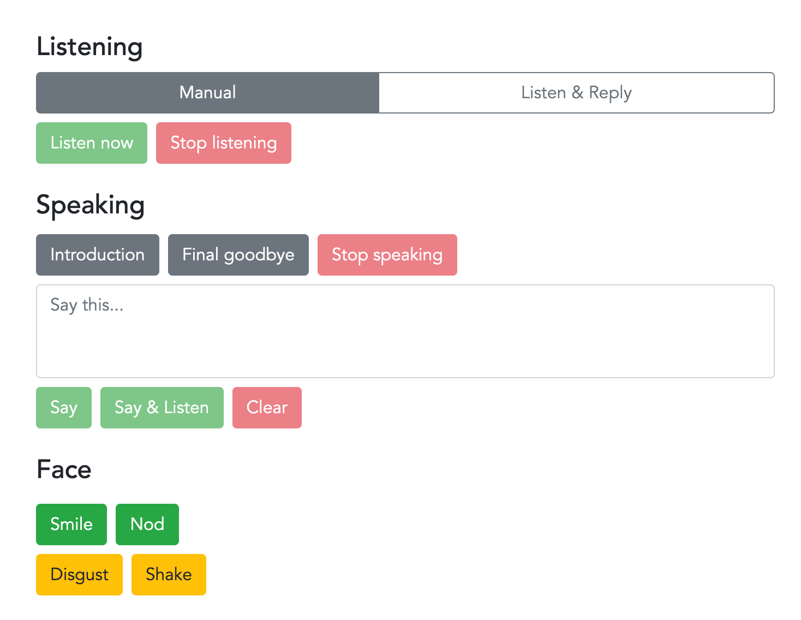

# Sahra Interview

Interview Sahra using a Furhat robot with answers either powered by OpenAI ChatGPT API (ChatGPT 4) or as a puppet under manual control.

You can find out more about Sahra here: https://www.autoura.com/recipes/sahra



## Scope

This skill is designed for web streaming. In particular the robot will not attend a user like _regular_ Furhat skills, instead will look ahead (i.e. at a video camera)

This skill could be used for stage presentations but you need to think about where the robot looks, perhaps including panned glancing towards the audience.

## One time setup

Two configurations required. You need to setup an OpenAI API key and you need to build the UI app.

#### 1) OpenAI
Setup an OpenAI account (https://platform.openai.com/) & API key
* Within src/main/kotlin/furhatos/app/sahra/settings/ rename openai_CONFIGURE.kt to openai.kt
* Set your OpenAI API key in that file   

```
val OPENAPI_KEY = "YOUR_OPENAI_API_KEY_HERE"
```

#### 2) UI app
Within the assets/gui directory, you need to build the UI app:

```
npm install
npm run build
```

This skill can be used either:
* Furhat virtual robot
* Compiled (e.g. IntelliJ), and uploaded/used on a Furhat hardware robot

## Modes & general use

The skill can be used in manual mode, or listen & reply mode. Or you can jump between modes during a conversation using the large button on the top of the screen.

Generally Sahra is either listening or talking, or waiting to be told what to do. If she listens, and there is silence, she will stop listening after 20 seconds. Press _listen now_ to start the listen process again.

Sahra will automatically reply if in listen & reply mode. Otherwise you as the human driver can put text into the say box, and tap say, and Sahra will immediately say that. Useful if you have a specific point to make and you are not sure that the OpenAI response will be what you want.

Two predefined text can be set for convenience.

We like using head movement gestures as these are clearer when web streaming. You can manually tap a gesture and this will not interupt any other action that is happening concurrently.

## Topics to talk about

* Ask her about stories from when Sahra is a tour guide
* Ask her about whether Sahra prefers day tours or multiday tours
* Ask her about what skills are useful for a tour guide to know

Remember to ask followup questions, if Sahra says something interesting, ask her about what she just said. This makes a more natural conversation.

What you can't ask about is locations or generate a tour itinerary. We have stopped Sahra talking about this (in this skill) via the OpenAI prompt.

## What to tell others

If you want to involve others chatting to Sahra they may not be familiar with how Furhat robots work. 

These simple rules will help:

* OpenAI's responses can take 4-5 seconds to reply. Talk when the LED is green (listening), don't talk when red (thinking)
* Maximum speak time is 20 seconds (Microsoft Speech to Text limit). But really should keep questions and interactions short
* An umm or err is not an interaction, nor is whistling. It has to be words that the speech to text can pickup

## Roadmap

* Event button for "err" or "ummm" - holding statement
* Longer listening (e.g. listen for 5 minutes then make a comment)
  * Say something (say anything related to conversation)
  * Say summary (summarise conversation to this point)
* Stage use - could define how to interact with the wider audience
* Update UI to Vue3 as Vue2 is EOL December 2023

## Ask us to build your Furhat skill

We at [Autoura](https://www.autoura.com) are a digital experience platform (DXP) operating tourism, leisure & hospitality experiences using AI characters (i.e. our own Sahra AI companion but also brand characters).

We can build [Furhat](https://furhatrobotics.com/) robot skills for you. We are not cheap, but we get it done.

## Legal notice

Although the code is MIT licensed, Sahra® is a registered trademark: European Union: 018181403, i.e. whatever you do with this code, you can't call what you create "Sahra"